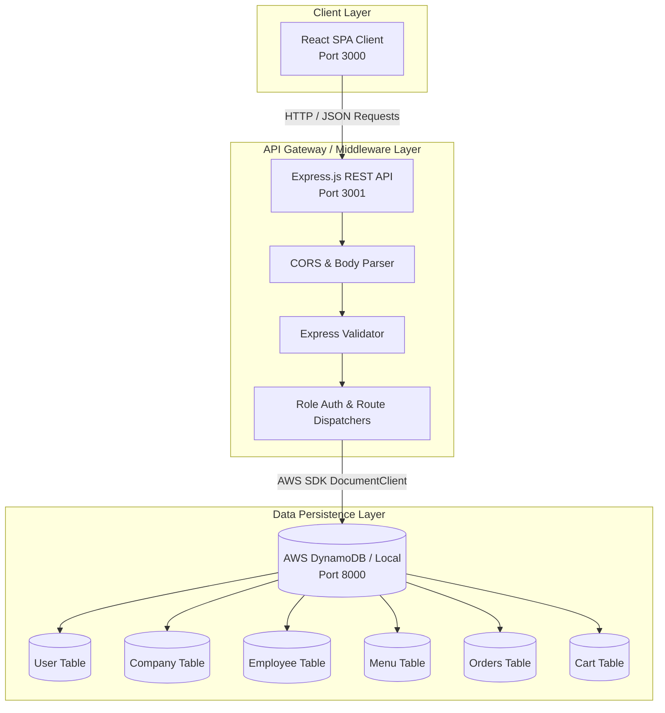

# Online Cafeteria Management System

[](https://reactjs.org/)
[](https://nodejs.org/)
[](https://expressjs.com/)
[](https://aws.amazon.com/dynamodb/)
[](LICENSE)

A multi-tenant, role-based corporate cafeteria ordering and catering management web application. Designed to streamline workplace meal scheduling, the system enables corporate employees to browse daily menus and pre-order upcoming meals from vetted food caterers, while providing corporate managers with employee access controls and caterers with live order pipeline fulfillment tools.

Inspired by enterprise food-ordering platforms such as Ritual, the system enforces configurable scheduling business rules (e.g., 12-hour ordering lockouts prior to pickup windows).

---

## System Architecture



---

## Role-Based Access Control (RBAC)

The application implements granular authorization for four distinct user archetypes:

| Role | Permissions & Capabilities | Key Workflows |
| :--- | :--- | :--- |
| **System Admin** | Global administrative jurisdiction over all platform entities. | Seed caterer accounts, approve company profiles, override profile credentials. |
| **Company Manager** | Manages corporate employee rosters and workplace cafeteria access. | Register company domain, onboard employees, offboard departed personnel. |
| **Food Caterer** | Manages culinary offerings and fulfills order queues. | Create daily menus, set pricing and dietary tags, monitor active meal quantities. |
| **Corporate Employee** | Browses menus, places advanced meal reservations, manages personal cart. | Place advance orders, modify/cancel orders (subject to the 12-hour lockout rule). |

---

## Business Logic & Rules Engine

1. **Advance Ordering**: Employees can order meals for upcoming days, but reservations lock strictly **12 hours before pickup** to ensure caterers can finalize ingredient procurement and preparation.
2. **Order Cancellations**: Cancellations are permitted until the 12-hour threshold; attempts to cancel within the 12-hour window are rejected with an explicit error policy.
3. **Multi-Tenant Company Scoping**: Employees must register under an active, verified corporate entity registered in the system.

---

## DynamoDB Data Models

| Table | Partition Key (HASH) | Sort Key (RANGE) | Description |
| :--- | :--- | :--- | :--- |
| `User` | `email` (String) | `type` (String) | User credentials and role classification (`Admin`, `Company`, `Caterer`, `User`). |
| `Company` | `name` (String) | `email` (String) | Corporate accounts and primary contact emails. |
| `Employee` | `company` (String) | `email` (String) | Active corporate employee roster mapping. |
| `Menu` | `name` (String) | `type` (String) | Caterer menu items, categories, ingredients, and prices. |
| `Orders` | `id` (String) | `email` (String) | Order records with timestamps, line items, and fulfillment status. |
| `Cart` | `email` (String) | `id` (String) | Transient shopping session state per user. |

---

## REST API Catalog

| Endpoint | Method | Role | Description |
| :--- | :--- | :--- | :--- |
| `/login` | `POST` | Public | Authenticates credentials and returns user role session metadata. |
| `/register` | `POST` | Public / Admin | Registers a new company, caterer, or employee user. |
| `/company/employees` | `GET` / `POST` | Company | Retrieves active employee list or onboards a new employee. |
| `/company/employees/:id`| `DELETE` | Company | Offboards an employee from the company roster. |
| `/menu` | `GET` | All | Retrieves available menu items across caterers. |
| `/menu` | `POST` / `DELETE` | Caterer | Adds a new dish or deletes an offering from the catalog. |
| `/orders` | `GET` | User / Caterer | Retrieves personal order history (User) or incoming order manifests (Caterer). |
| `/orders` | `POST` | User | Submits cart items to create an official order reservation. |
| `/orders/:id` | `DELETE` | User | Cancels an order if placed outside the 12-hour cutoff window. |
| `/cart` | `GET` / `POST` / `DELETE` | User | Manages transient items prior to checkout submission. |
| `/settings` | `PUT` | All | Updates user profile and security information. |

---

## Getting Started

### Prerequisites

- **Node.js** (v12+ recommended)
- **npm** (v6+)
- **DynamoDB Local** (Docker or Java runtime)

### 1. Start DynamoDB Local

You can launch a local DynamoDB instance using Docker:

```bash
docker run -p 8000:8000 amazon/dynamodb-local
```

Alternatively, download and run the AWS DynamoDB Local `.jar` directly.

### 2. Configure & Start Backend Service

```bash
cd cafeteria_backend-master
npm install
node app.js
```

> The backend automatically provisions the required DynamoDB tables (`User`, `Company`, `Employee`, `Menu`, `Orders`, `Cart`) upon boot.

The backend API will listen on `http://localhost:3001`.

### 3. Configure & Start Frontend Client

```bash
cd cafeteria_frontend-master
npm install
npm start
```

The React client will launch at `http://localhost:3000`.

---

## Interface Showcase

### Authentication & Access Control

| Role Login Screen | Invalid Company Credential Alert |
| :---: | :---: |
|  |  |

---

### Corporate Management Portal

| Employee Directory | Onboard New Employee |
| :---: | :---: |
|  |  |

| Delete Employee Confirmation | Updated Roster View |
| :---: | :---: |
|  |  |

---

### Caterer Portal

| Caterer Dashboard | Add Menu Item |
| :---: | :---: |
|  |  |

| Kitchen Order Manifest View |
| :---: |
|  |

---

### Employee Ordering Experience

| Employee Registration | Menu Selection & Order Submission |
| :---: | :---: |
|  |  |

| Active Order Manifest | Item Cancellation (Within Policy) |
| :---: | :---: |
|  |  |

| 12-Hour Cutoff Enforcement Alert | User Account Settings |
| :---: | :---: |
|  |  |

---

## Video Walkthrough

A complete functional demonstration video is available here:  
🎬 **[Google Drive Functional Demonstration](https://drive.google.com/file/d/1aB6g_3Au31SJBCjUM7RhuS4FLITSGOQ3/view?usp=sharing)**

---

## License

This project is licensed under the MIT License - see the [LICENSE](LICENSE) file for details.
